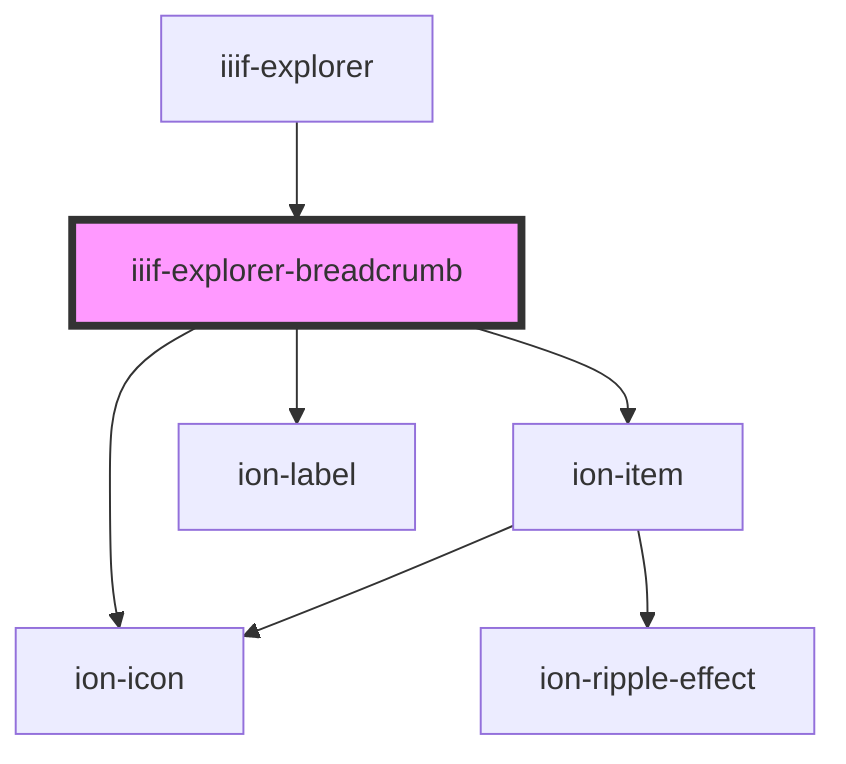

# iiif-explorer-breadcrumb

<!-- Auto Generated Below -->

## Properties

| Property     | Attribute | Description | Type         | Default     |
| ------------ | --------- | ----------- | ------------ | ----------- |
| `collection` | --        |             | `Collection` | `undefined` |
| `enabled`    | `enabled` |             | `boolean`    | `true`      |
| `isOpen`     | `is-open` |             | `boolean`    | `undefined` |

## Events

| Event              | Description | Type               |
| ------------------ | ----------- | ------------------ |
| `selectBreadcrumb` |             | `CustomEvent<any>` |
| `upLevel`          |             | `CustomEvent<any>` |

## Dependencies

### Used by

 - [iiif-explorer](../iiif-explorer)

### Depends on

- ion-item
- ion-icon
- ion-label

### Graph

----------------------------------------------

*Built with [StencilJS](https://stenciljs.com/)*
