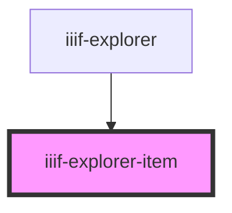

# iiif-explorer-item

<!-- Auto Generated Below -->

## Properties

| Property   | Attribute  | Description | Type           | Default     |
| ---------- | ---------- | ----------- | -------------- | ----------- |
| `item`     | --         |             | `IIIFResource` | `undefined` |
| `selected` | `selected` |             | `boolean`      | `false`     |

## Events

| Event        | Description | Type               |
| ------------ | ----------- | ------------------ |
| `selectItem` |             | `CustomEvent<any>` |

## Dependencies

### Used by

 - [iiif-explorer](../iiif-explorer)

### Graph

----------------------------------------------

*Built with [StencilJS](https://stenciljs.com/)*
