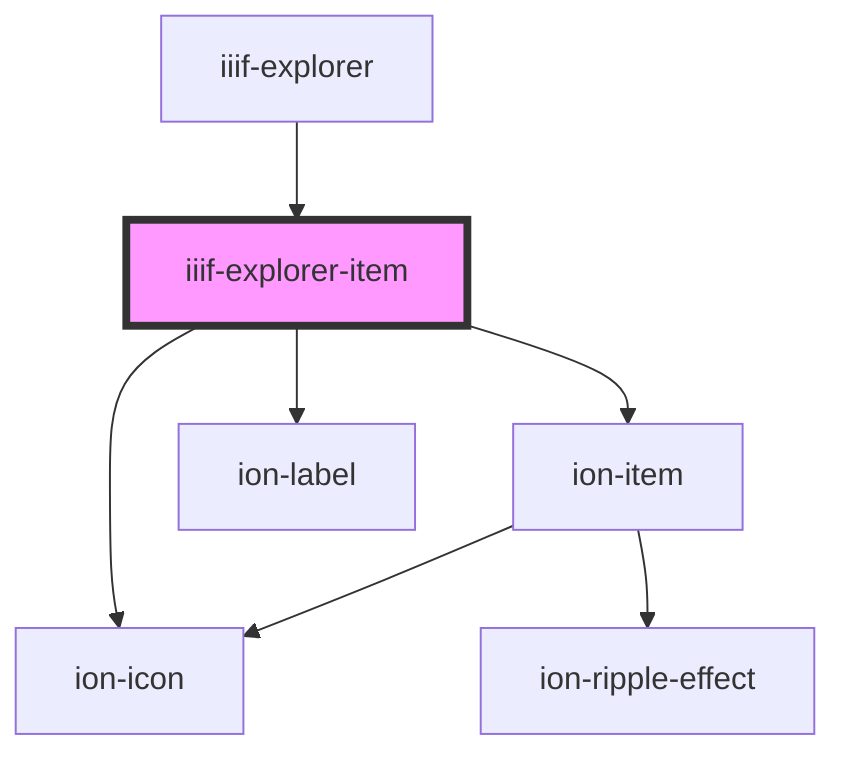

# iiif-explorer-item

<!-- Auto Generated Below -->

## Properties

| Property      | Attribute      | Description | Type           | Default     |
| ------------- | -------------- | ----------- | -------------- | ----------- |
| `copyEnabled` | `copy-enabled` |             | `boolean`      | `true`      |
| `enabled`     | `enabled`      |             | `boolean`      | `true`      |
| `item`        | --             |             | `IIIFResource` | `undefined` |
| `selected`    | `selected`     |             | `boolean`      | `false`     |

## Events

| Event        | Description | Type               |
| ------------ | ----------- | ------------------ |
| `selectItem` |             | `CustomEvent<any>` |

## Dependencies

### Used by

 - [iiif-explorer](../iiif-explorer)

### Depends on

- ion-item
- ion-icon
- ion-label

### Graph

----------------------------------------------

*Built with [StencilJS](https://stenciljs.com/)*
