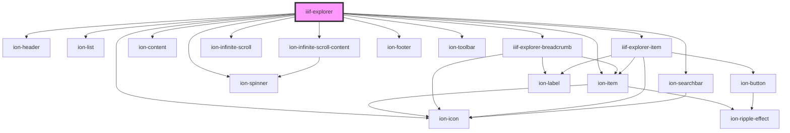

# iiif-explorer

<!-- Auto Generated Below -->

## Properties

| Property            | Attribute             | Description | Type      | Default     |
| ------------------- | --------------------- | ----------- | --------- | ----------- |
| `copyEnabled`       | `copy-enabled`        |             | `boolean` | `false`     |
| `manifest`          | `manifest`            |             | `string`  | `undefined` |
| `pageLoadThreshold` | `page-load-threshold` |             | `string`  | `"10%"`     |
| `pageSize`          | `page-size`           |             | `number`  | `50`        |
| `pagingEnabled`     | `paging-enabled`      |             | `boolean` | `undefined` |
| `pagingLimitKey`    | `paging-limit-key`    |             | `string`  | `"_limit"`  |
| `pagingStartKey`    | `paging-start-key`    |             | `string`  | `"_start"`  |
| `searchEnabled`     | `search-enabled`      |             | `boolean` | `true`      |
| `upLevelEnabled`    | `up-level-enabled`    |             | `boolean` | `true`      |

## Events

| Event              | Description | Type               |
| ------------------ | ----------- | ------------------ |
| `selectCollection` |             | `CustomEvent<any>` |
| `selectManifest`   |             | `CustomEvent<any>` |

## Dependencies

### Depends on

- ion-header
- ion-list
- ion-item
- ion-icon
- ion-spinner
- [iiif-explorer-breadcrumb](../iiif-explorer-breadcrumb)
- ion-content
- [iiif-explorer-item](../iiif-explorer-item)
- ion-infinite-scroll
- ion-infinite-scroll-content
- ion-footer
- ion-toolbar
- ion-searchbar

### Graph

----------------------------------------------

*Built with [StencilJS](https://stenciljs.com/)*
