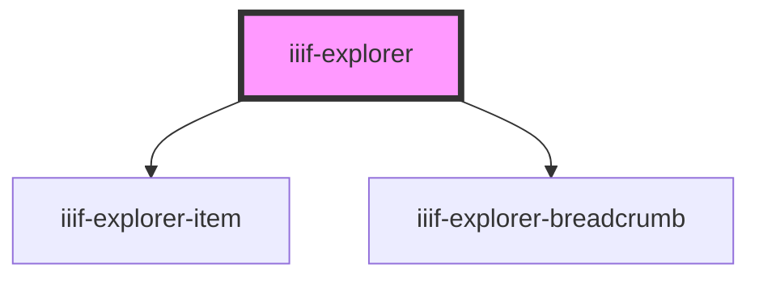

# iiif-explorer

<!-- Auto Generated Below -->

## Properties

| Property         | Attribute          | Description | Type      | Default     |
| ---------------- | ------------------ | ----------- | --------- | ----------- |
| `manifest`       | `manifest`         |             | `string`  | `undefined` |
| `upLevelEnabled` | `up-level-enabled` |             | `boolean` | `true`      |

## Events

| Event              | Description | Type               |
| ------------------ | ----------- | ------------------ |
| `selectCollection` |             | `CustomEvent<any>` |
| `selectManifest`   |             | `CustomEvent<any>` |
| `upLevel`          |             | `CustomEvent<any>` |

## Dependencies

### Depends on

- [iiif-explorer-item](../iiif-explorer-item)
- [iiif-explorer-breadcrumb](../iiif-explorer-breadcrumb)

### Graph

----------------------------------------------

*Built with [StencilJS](https://stenciljs.com/)*
